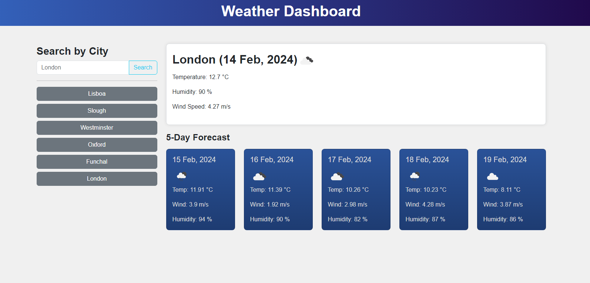

# Weather Dashboard

## Description

The Weather Dashboard is a web application that allows users to view the weather outlook for multiple cities. Users can plan their trips accordingly by checking the current and future weather conditions for various cities. The application utilizes server-side APIs to retrieve weather data and dynamically updates the HTML and CSS to display the information.

## Overview

This project aims to provide users with a simple and intuitive tool to access weather forecasts for different cities. By leveraging the OpenWeatherMap API, users can search for cities and view detailed weather information, including temperature, humidity, wind speed, and weather conditions for both current and future dates.
<!-- 

## Demo

Demo link: [Weather Dashboard Demo](#) 
-->

## Features

- Search for a city and view current weather conditions.
- Display the city name, date, weather icon, temperature, humidity, and wind speed for the current weather.
- View a 5-day forecast for the selected city, including date, weather icon, temperature, and humidity.
- Store search history in local storage for quick access to previously searched cities.
- Retrieve geographical coordinates for a city using the OpenWeatherMap API.
- Utilize localStorage to store persistent data and ensure a seamless user experience across sessions.

## Screenshot

  
*The above image illustrates an example of the Weather Dashboard displaying weather information for multiple cities, including current conditions and a 5-day forecast.*

## Deployment

This project is deployed and accessible at the following URLs:

- [Live Application](https://deponte-designer.github.io/Weather-Dashboard/): Visit this link to explore the Weather Dashboard.
- [GitHub Repository](https://github.com/deponte-designer/Weather-Dashboard): Visit the repository for project details, including comprehensive README.

## Technologies Used

- HTML5
- CSS3
- JavaScript
- Bootstrap
- jQuery
- Day.js
- OpenWeatherMap API

## Usage

To use the Weather Dashboard:

1. Enter a city name in the search input field.
2. Press the "Search" button or hit Enter to retrieve weather data for the specified city.
3. View the current weather conditions and the 5-day forecast.
4. Click on a city in the search history to quickly access its weather information.

## License

Copyright (c) 2024 [dePonte](https://github.com/deponte-designer)

Permission is hereby granted, free of charge, to any person obtaining a copy
of this software and associated documentation files (the "Software"), to deal
in the Software without restriction, including without limitation the rights
to use, copy, modify, merge, publish, distribute, sublicense, and/or sell
copies of the Software, and to permit persons to whom the Software is
furnished to do so, subject to the following conditions:

The above copyright notice and this permission notice shall be included in all
copies or substantial portions of the Software.

THE SOFTWARE IS PROVIDED "AS IS", WITHOUT WARRANTY OF ANY KIND, EXPRESS OR
IMPLIED, INCLUDING BUT NOT LIMITED TO THE WARRANTIES OF MERCHANTABILITY,
FITNESS FOR A PARTICULAR PURPOSE AND NONINFRINGEMENT. IN NO EVENT SHALL THE
AUTHORS OR COPYRIGHT HOLDERS BE LIABLE FOR ANY CLAIM, DAMAGES OR OTHER
LIABILITY, WHETHER IN AN ACTION OF CONTRACT, TORT OR OTHERWISE, ARISING FROM,
OUT OF OR IN CONNECTION WITH THE SOFTWARE OR THE USE OR OTHER DEALINGS IN THE
SOFTWARE.

## Badges

<!-- Todo: Include badges for HTML5, CSS3, JavaScript, Bootstrap, jQuery, etc. -->

